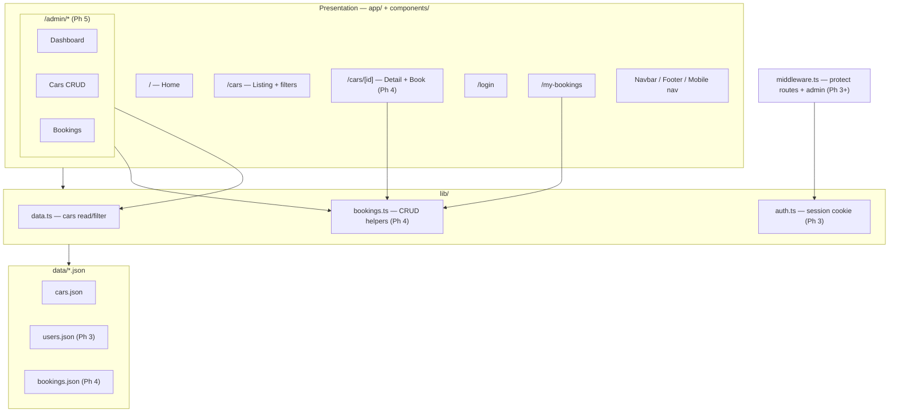
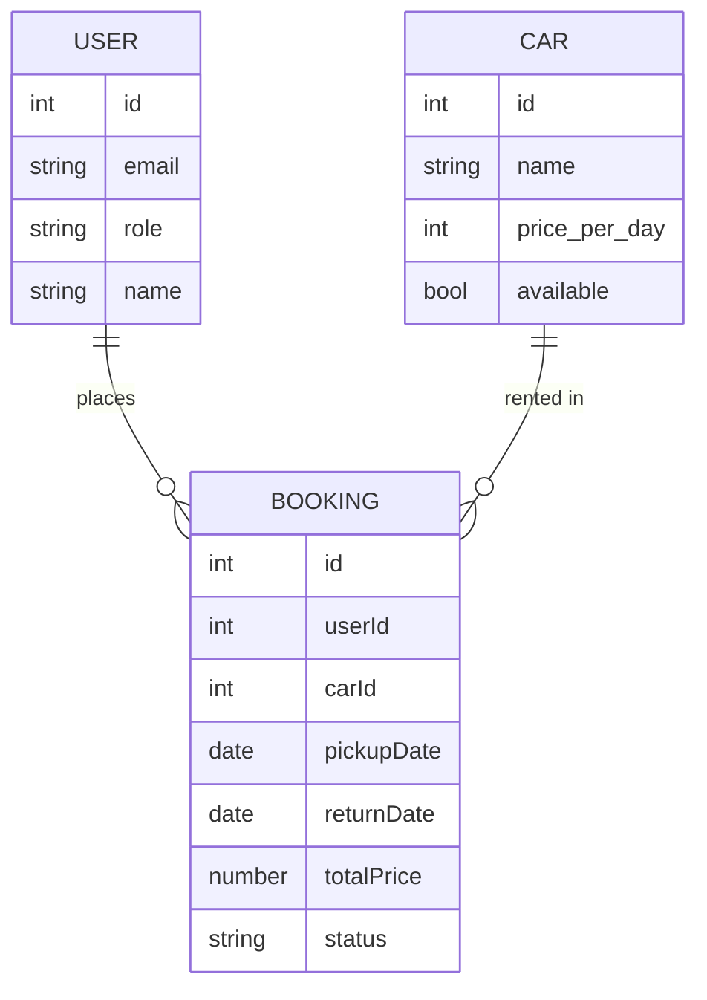

# DriveEase — Project overview (Phases 1–5)

A **Next.js 14** (App Router) car-rental experience: marketing + catalog → mock auth → user bookings → admin CRUD, backed by JSON files for a POC (no real database in these phases).

---

## Phases at a glance

| Phase | Focus | Main outcome |
|--------|--------|----------------|
| **1** | Setup & shell | Next.js + Tailwind + shadcn; Navbar / Footer / mobile nav; Home hero → `/cars`; no backend/auth |
| **2** | Catalog | `cars.json`, `lib/data.ts`, grid + filters + `/cars/[id]`; mock images; "Book" stub |
| **3** | Auth (mock) | `users.json`, `lib/auth.ts`, cookie session, middleware, Auth context, `/login`, role redirects |
| **4** | Booking | `bookings.json`, `lib/bookings.ts`, book from car detail, `/my-bookings`, Server Actions + file writes |
| **5** | Admin | `/admin/*` layout + dashboard + cars CRUD + bookings view; admin-only middleware |

---

## Module / architecture diagram

High-level layers: **UI** (`app/` + `components/`) → **lib** (auth, data, bookings) → **JSON data** → **middleware** for route protection.



---

## End-to-end user flows

### Visitor → catalog → login → book

```mermaid
flowchart LR
  V[Visitor] --> Home[Home]
  Home --> Cars[/cars]
  Cars --> Detail[/cars/id]
  Detail -->|not logged in| Login[/login]
  Login -->|user| Detail
  Detail -->|submit booking| My[/my-bookings]
```

### Admin path

```mermaid
flowchart LR
  A[Admin] --> Login[/login]
  Login -->|role admin| Dash[/admin/dashboard]
  Dash --> AC[/admin/cars]
  Dash --> AB[/admin/bookings]
```

---

## Data model (conceptual)



- Phase 2: cars only.
- Phase 3: users.
- Phase 4: bookings link users + cars.
- Phase 5: admin mutates cars and views/edits bookings.

---

## Route and protection map (Phases 3–5)

| Route pattern | Who |
|----------------|-----|
| `/`, `/cars`, `/cars/[id]` (browse) | Public (booking submit may require login per plan) |
| `/login` | Public |
| Booking flow, `/my-bookings` | Authenticated user |
| `/admin/*` | `role === "admin"` |

---

## Tech stack (Phase 1 baseline)

- **Next.js 14** (App Router), **TypeScript**, **Tailwind**, **shadcn/ui**
- **Auth POC**: cookies + context; **middleware** for guards
- **Persistence POC**: JSON files + Server Actions (append/update on server)

---

## Using this as a presentation

- **Phases at a glance** — agenda / timeline slide
- **Module diagram** — architecture
- **User flows** — product story
- **Data model** — entities and relationships
- **Route map** — security and routing
- **Tech stack** — appendix

Mermaid diagrams render on GitHub, many wikis, and tools that support Mermaid (e.g. some slide exporters).

---

## Related docs

- [phase1.md](./phase1.md) — Project setup and layout
- [phase2.md](./phase2.md) — Car listing, filters, detail
- [phase3.md](./phase3.md) — Authentication (mock JSON)
- [phase4.md](./phase4.md) — Booking system (user)
- [phase5.md](./phase5.md) — Admin panel
